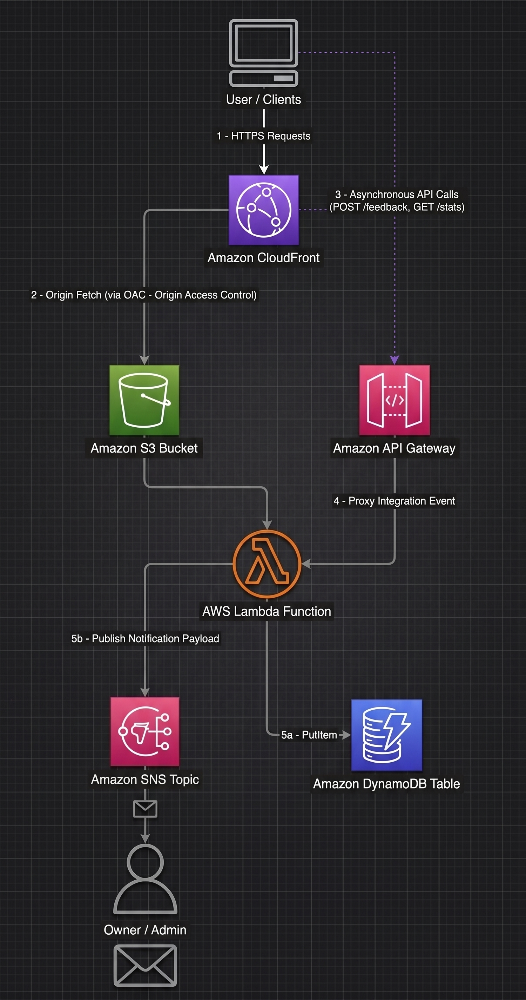

# Fully Serverless Event Driven Feedback Pipeline on AWS

<p align="center">
  
  
  

  >A fully serverless, highly scalable, and event-driven feedback processing system built on Amazon Web Services (AWS). The application delivers a responsive static frontend securely via a global CDN, decouples backend APIs, persists structured records with low latency, and triggers real-time admin notifications.

##  Overview

**The application follows a decoupled modern cloud-native pattern:**

**1. Client & Edge Tier:**
Users access the frontend globally over HTTPS via Amazon CloudFront.
CloudFront securely retrieves static assets (index.html, style.css, script.js) hosted in an Amazon S3 bucket using Origin Access Control (OAC) to prevent direct public access to S3.

**2. API & Routing Tier:**
Browser client issues asynchronous HTTP fetch requests (POST /feedback, GET /stats) to Amazon API Gateway (REST API) with CORS and rate-limiting support.

**3. Compute Tier:**
API Gateway routes payload via Lambda Proxy Integration to an AWS Lambda function running Python 3.12.
Lambda handles data validation, sanitization, and business logic execution.

**4. Data & Notification Tier:**
Amazon DynamoDB: Stores structured feedback records (timestamp, name, email, message, status) using On-Demand capacity.
Amazon SNS: Lambda publishes real-time notification messages to an SNS topic, which immediately fans out alert emails to the site owner/admin.

**5. Security & Observability:**
IAM Least Privilege: Dedicated IAM roles restricting Lambda access strictly to specific DynamoDB and SNS ARNs.
Amazon CloudWatch: Unified logging and metrics tracking execution performance and error rates.

## Architecture



##  AWS Services Used

| Service | Role | Free Tier Limit |
|---|---|---|
| **Amazon S3** | Hosts the static frontend | 5GB + 20K GETs/month |
| **Amazon CloudFront** | CDN + HTTPS delivery | 1TB transfer/month |
| **Amazon API Gateway** | REST API endpoints | 1M requests/month (1st year) |
| **AWS Lambda** | Backend business logic | 1M invocations/month |
| **Amazon DynamoDB** | Stores all messages | 25GB + 200M requests/month |
| **Amazon SNS** | Email notifications | 1,000 emails/month |
| **AWS IAM** | Lambda permissions | Always free |

## Project Structure

```
feedback-project/
│
├── frontend/
│   ├── index.html       # Contact form UI
│   ├── style.css        # Styles and responsive design
│   └── script.js        # API calls and form logic
│
├── lambda/
│   └── code.py   # Handles POST /feedback & GET /stats
│
└── README.md
```

### Features

- ✅ Real-time form submission with loading state
- ✅ Instant email notification to site owner
- ✅ Message counter showing total submissions
- ✅ Input validation on both client and server side
- ✅ HTTPS via CloudFront
- ✅ 100% Serverless — zero server management
- ✅ Runs entirely on AWS Free Tier

##  Future Improvements

- [ ] Add **Amazon Cognito** for admin dashboard with login
- [ ] Add **SES (Simple Email Service)** to send a reply to the user
- [ ] Add **CloudWatch Dashboard** for message analytics
- [ ] Add **rate limiting** in API Gateway to prevent spam
- [ ] Store message **attachments** in S3
- [ ] Add **spam filter** using AWS Comprehend
